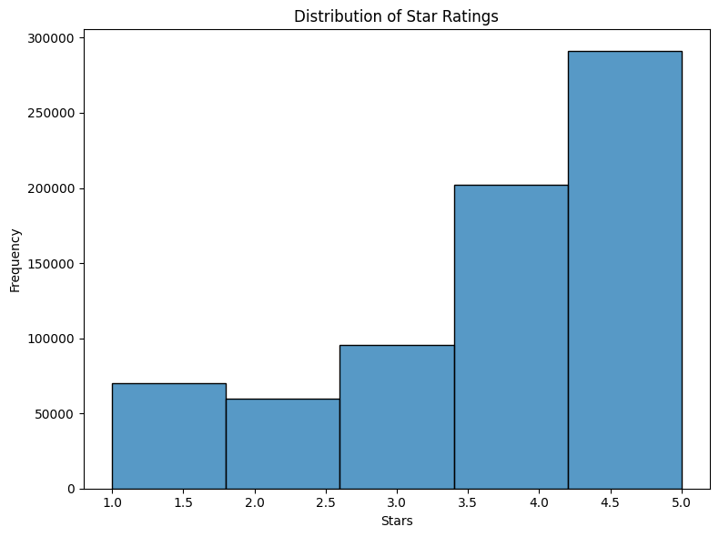

# LLM Project: Sentiment Analysis on Yelp Reviews

## Project Task
This project aims to build a sentiment analysis model using a pre-trained Language Model (LLM) to classify Yelp restaurant reviews into three sentiment categories: **Positive**, **Neutral**, and **Negative**. The model is fine-tuned on a subset of the Yelp Open Dataset to predict the sentiment expressed in the review text. Check it out here [Yelp Sentiment Analyzer](https://huggingface.co/spaces/fitsblb/YelpSentimentAnalyzer) and check out the model here if you want to play with it [model](https://huggingface.co/fitsblb).

## Dataset
The project utilizes the [Yelp Open Dataset](https://www.kaggle.com/datasets/capple7/yelp-open-data-philly-restaurants) focusing on restaurant reviews. The dataset contains:

*   **text**: The text of the review.
*   **stars**: The star rating given by the reviewer (1 to 5 stars).
  >

A subset of the dataset ("Final.csv") is loaded from Kaggle using the `kagglehub` library. The code uses the entire dataset for final training.

## Pre-trained Model
The project leverages the `distilbert-base-uncased` pre-trained transformer model from Hugging Face. DistilBERT is a smaller, faster, cheaper and lighter version of BERT. It is a great general purpose model that can be fine-tuned for various downstream tasks. The model is fine-tuned for sequence classification to predict the sentiment of the Yelp reviews. The hyperparameter search uses the `AutoModelForSequenceClassification` class.

## Performance Metrics
The model's performance is evaluated using the following metrics:

*   **Accuracy**: The overall correctness of the model's predictions.
*   **Precision**: The ability of the model to correctly identify positive instances out of all instances it predicted as positive.
*   **Recall**: The ability of the model to identify all actual positive instances.
*   **F1-score**: The harmonic mean of precision and recall, providing a balanced measure of the model's performance.

These metrics are computed using the `compute_metrics` function, which leverages the `precision_recall_fscore_support` and `accuracy_score` functions from `sklearn.metrics`.

## Hyperparameters
The project explores hyperparameter tuning to optimize the model's performance. The hyperparameter search is performed using Optuna via `trainer.hyperparameter_search`. The process and search space explored are documented in the `Yelp_sentiment_analyzer_hyperparameter_search.ipynb` notebook.

**Search Space:**

The hyperparameter search explored the following parameters:

*   **learning\_rate**: The learning rate for the AdamW optimizer. Explored values ranged from `5.753479812542046e-06` to `7.909607297856461e-05`.
*   **num\_train\_epochs**: The number of training epochs. Explored values ranged from `2 to 4`.
*   **per\_device\_train\_batch\_size**: The batch size used for training. Explored values included `4, 16 and 32`.
*   **seed**: Random seed for reproducibility. Explored values included `5,6,10,17 and 40`.

**Best Hyperparameters**

The best hyperparameters found during the search were:

*   **learning\_rate**: `7.91e-5`
*   **num\_train\_epochs**: `2`
*   **seed**: `5`
*   **per\_device\_train\_batch_size**: `32`

These hyperparameters were then used to retrain the model on the full dataset.

**Training Details:**

*   The model was trained for 2 epochs.
*   A batch size of 32 was used during training.
*   The `seed` was set to 5.
*   Evaluation strategy was set to "epoch" with saving strategy also being set to "epoch" to evaluate at the end of each epoch and save at the end of each epoch.
*   Best model was loaded at the end of training with `load_best_model_at_end=True`.
*   Logging was reported to Weights and Biases `report_to="wandb"`.

## Results

The model achieved the following performance on the test dataset:

*   **Accuracy**: `0.7850`
*   **F1**: `0.7840`
*   **Precision**: `0.7837`
*   **Recall**: `0.7850`

## Code Structure

The project's code is organized as follows:

*   **`utility.py`**: Contains reusable functions for data loading, preprocessing, model configuration, training, and evaluation.  (See "Reusable Functions" section below for details).
*   **`Final_Training.ipynb`**: Jupyter Notebook containing the main workflow for final model training and evaluation using the best hyperparameters.

## 📁 File Organization

```
Sentiment-Analyzer/
├── 📓 HyperParamSearch.ipynb          # Hyperparameter optimization notebook with Optuna
├── 📓 Final_Training.ipynb            # Complete model training and deployment pipeline
├── 🐍 utility.py                     # Reusable functions for data processing and model training
├── 📋 requirements.txt                # Project dependencies (cleaned and optimized)
├── 🖼️ image.png                       # Dataset sample visualization for README
├── 🔧 widget_repair.py               # Jupyter widget compatibility fixes
├── 📖 README.md                      # Project documentation (this file)
├── 
├── 📁 Pre_processed/                  # Preprocessed dataset splits
│   ├── 📁 train/                     # Training data
│   │   ├── data-00000-of-00001.arrow # Tokenized training examples
│   │   ├── dataset_info.json        # Dataset metadata
│   │   └── state.json               # Dataset state information
│   ├── 📁 val/                      # Validation data
│   │   ├── data-00000-of-00001.arrow # Tokenized validation examples
│   │   ├── dataset_info.json        # Dataset metadata
│   │   └── state.json               # Dataset state information
│   └── 📁 test/                     # Test data
│       ├── data-00000-of-00001.arrow # Tokenized test examples
│       ├── dataset_info.json        # Dataset metadata
│       └── state.json               # Dataset state information
├── 
├── 📁 Yelp_Model/                     # Trained model artifacts
│   ├── config.json                   # Model configuration (DistilBERT settings)
│   ├── model.safetensors            # Model weights (safe format)
│   ├── special_tokens_map.json      # Special token mappings
│   ├── tokenizer_config.json        # Tokenizer configuration
│   ├── tokenizer.json               # Tokenizer vocabulary and rules
│   ├── training_args.bin            # Training arguments used
│   └── vocab.txt                    # Vocabulary file
├── 
└── 📁 __pycache__/                   # Python bytecode cache
    └── utility.cpython-311.pyc      # Compiled utility functions
```

### 📝 File Descriptions

#### **Core Notebooks**
- **`HyperParamSearch.ipynb`**: Interactive notebook for hyperparameter optimization using Optuna. Contains the complete pipeline from data loading to model evaluation with intelligent parameter search.
- **`Final_Training.ipynb`**: Production training notebook that uses optimized hyperparameters to train the final model and deploy it to Hugging Face Hub.

#### **Python Modules**
- **`utility.py`**: Central module containing all reusable functions including data loading, EDA, preprocessing, model configuration, training, and evaluation utilities.
- **`requirements.txt`**: Minimalist dependencies file containing only necessary packages (no unused imports like NLTK or PEFT).

#### **Data Directories**
- **`Pre_processed/`**: Contains preprocessed and tokenized datasets split into train/validation/test sets using Hugging Face Datasets format for efficient loading.
- **`Yelp_Model/`**: Trained model directory containing the fine-tuned DistilBERT model, tokenizer, and all configuration files ready for deployment.

#### **Supporting Files**
- **`widget_repair.py`**: Utility script for fixing Jupyter widget compatibility issues in different environments.
- **`image.png`**: Sample dataset visualization used in README documentation.

### 🚀 Workflow Integration

1. **Development Phase**: `HyperParamSearch.ipynb` → Find optimal hyperparameters
2. **Production Phase**: `Final_Training.ipynb` → Train final model with best settings
3. **Deployment**: Model artifacts in `Yelp_Model/` → Ready for Hugging Face Hub or local serving
4. **Reusability**: `utility.py` → Modular functions for easy project extension

## Reusable Functions (from `utility.py`)

*   **`load_dataset(file_path, columns)`**: Loads the dataset from a specified file path, selecting specified columns.
*   **`perform_eda(review_df, visualize=False)`**: Performs exploratory data analysis on the dataset.  Includes missing value checks and star rating distribution.  Can optionally create visualizations.
*   **`preprocess_yelp_reviews(review_df)`**: Preprocesses the Yelp review data, converting star ratings to zero-indexed values and assigning sentiment labels (positive, neutral, negative).
*   **`advanced_text_preprocessing(text)`**: Cleans and preprocesses text by removing HTML tags, special characters, digits, and extra whitespaces, and converting the text to lowercase.
*   **`prepare_datasets(review_df, model_name="distilbert-base-uncased", test_size=0.3)`**: Splits the data into training, validation, and test sets, and tokenizes the text data using the specified pre-trained model's tokenizer.
*   **`create_model_config(num_labels=3)`**: Creates the configuration for the DistilBERT model, including dropout probabilities.
*   **`compute_metrics(pred)`**: Computes evaluation metrics (accuracy, precision, recall, F1-score) from the model's predictions.
*   **`evaluate_model_on_test(trainer, test_dataset)`**: Evaluates the trained model on the test dataset.
*   **`save_trained_model_and_tokenizer(trainer, tokenizer, save_path="/content/drive/MyDrive/LLM Project/Model")`**: Saves the trained model and tokenizer to a specified directory, adding a timestamp to the save path.

## Getting Started

1.  **Clone the repository.**
2.  **Install the required libraries:**
    ```
    pip install -r requirements.txt
    ```
3.  **Download the Yelp Open Dataset** and place the "Final.csv" file in the appropriate directory or update the `file_path` variable in the notebook.
4.  **Run the `Final_Training.ipynb` notebook.**

## Future Work

*   Explore other pre-trained models.
*   Experiment with different hyperparameter optimization techniques.
*   Investigate more advanced text preprocessing methods.
*   Deploy the trained model for real-time sentiment analysis.

