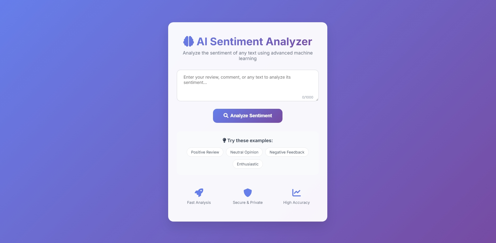
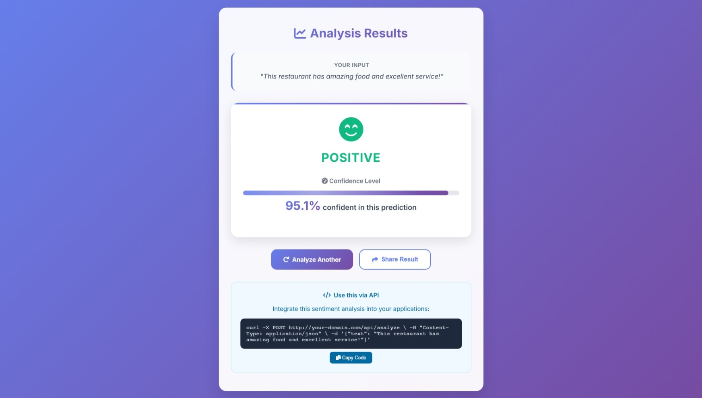

# 🚀 Advanced Sentiment Analyzer - Multi-Model AI System

<div align="center">


**🎯 Enterprise-Grade Sentiment Analysis with Multi-Model Comparison**

*Transform any text into actionable sentiment insights using 4 AI models working in harmony*

[🌐 **Live Demo**](https://your-app.railway.app) • [📖 **API Docs**](#-api-documentation) • [🚀 **Deploy**](#-quick-deployment) • [🔧 **Features**](#-key-features)

</div>

---

## 🌟 **What Makes This Special**

This isn't just another sentiment analyzer - it's a **production-ready ML system** that combines multiple AI models to provide more accurate and reliable sentiment predictions than any single model alone.

### ✨ **Key Highlights:**
- 🤖 **4 AI Models** working together: YelpReviewsAnalyzer, DistilBERT, Twitter-RoBERTa, FinBERT
- 🎯 **Consensus Building** - Models vote on the final prediction for higher accuracy
- ⚡ **Parallel Processing** - All models run simultaneously for fast results
- 📊 **Real-time Analytics** - Performance monitoring and model comparison
- 🔄 **Batch Processing** - Analyze up to 50 texts at once
- 🌐 **Beautiful Web Interface** - Modern, responsive design
- 🚀 **Production APIs** - RESTful endpoints for easy integration

---

## 🖼️ **Screenshots**

<div align="center">

### 🏠 **Modern Web Interface**


### 📊 **Detailed Results with Confidence**
!

</div>

---

## 🔥 **Key Features**

### 🤖 **Multi-Model Intelligence**
- **Primary Model**: Custom YelpReviewsAnalyzer (fine-tuned for reviews)
- **Comparison Models**: DistilBERT, Twitter-RoBERTa, FinBERT
- **Consensus Algorithm**: Weighted voting system for final predictions
- **Fallback System**: Graceful handling when models fail

### 🌐 **Modern Web Interface**
- **Glass-morphism Design**: Beautiful, modern UI with smooth animations
- **Real-time Analysis**: Instant sentiment prediction as you type
- **Confidence Visualization**: Color-coded results with confidence scores
- **Mobile Responsive**: Works perfectly on all devices

### 🚀 **Advanced APIs**

#### **API v1 - Basic Analysis**
```bash
POST /api/analyze
{
  "text": "This product is amazing!"
}
```

#### **API v2 - Advanced Features**
```bash
# Multi-model comparison
POST /api/v2/compare
{
  "text": "This is fantastic quality!"
}

# Batch processing
POST /api/v2/batch
{
  "texts": ["Great product!", "Poor quality", "It's okay"]
}

# Performance analytics
GET /api/v2/analytics
```

### 📊 **Built-in Analytics**
- **Model Performance**: Track accuracy and speed of each model
- **Processing Time**: Monitor response times and optimize performance
- **Error Rates**: Automatic error tracking and health monitoring
- **Usage Statistics**: Understand how your API is being used

---

## 🚀 **Quick Start**

### 🏃‍♂️ **Run Locally (2 minutes)**

```bash
# Clone the repository
git clone https://github.com/fitsblb/Sentiment-Analyzer.git
cd Sentiment-Analyzer

# Activate conda environment
conda activate sentiment-analyzer

# Start the server
python app/app.py
```

🌐 **Open**: http://localhost:5000

### ☁️ **Deploy to Cloud (5 minutes)**

Choose your favorite platform:

| Platform | Free Tier | Deployment |
|----------|-----------|------------|
| 🚀 **Railway** | 500hrs/month | [](https://railway.app) |
| 🐙 **Render** | 750hrs/month | [](https://render.com) |
| ☁️ **Google Cloud** | 2M requests/month | `gcloud run deploy --source .` |

---

## 📖 **API Documentation**

### 🔗 **Base URL**
```
https://your-app.railway.app
```

### 📋 **Endpoints Overview**

#### **GET /api/info**
Get API information and available features

```json
{
  "name": "Sentiment Analyzer API",
  "version": "2.0.0",
  "features": {
    "basic_analysis": true,
    "model_comparison": true,
    "batch_processing": true,
    "analytics": true
  }
}
```

#### **POST /api/analyze** - Basic Analysis
Single model sentiment analysis

```json
// Request
{
  "text": "This is an amazing product!"
}

// Response
{
  "sentiment": "Positive",
  "confidence": 0.9567,
  "processing_time": 0.123
}
```

#### **POST /api/v2/compare** - Multi-Model Comparison
Get predictions from all models with consensus

```json
// Request
{
  "text": "This product exceeded my expectations!"
}

// Response
{
  "consensus": {
    "sentiment": "Positive",
    "confidence": 0.8791,
    "agreement_score": 0.875
  },
  "model_results": [
    {
      "model": "YelpReviewsAnalyzer",
      "sentiment": "Positive",
      "confidence": 0.9234
    },
    // ... other models
  ]
}
```

#### **POST /api/v2/batch** - Batch Processing
Analyze multiple texts efficiently

```json
// Request
{
  "texts": [
    "Great product!",
    "Poor quality",
    "It's okay"
  ]
}

// Response
{
  "batch_size": 3,
  "results": [
    {
      "index": 0,
      "text": "Great product!",
      "sentiment": "Positive",
      "confidence": 0.9123
    }
    // ... other results
  ]
}
```

---

## 🏗️ **Architecture**

### 🧠 **Model Pipeline**
```
User Input → Text Preprocessing → Parallel Model Execution → Consensus Building → Result
     ↓              ↓                        ↓                     ↓            ↓
  Validation   Tokenization        4 Models Running           Weighted Voting   Response
```

### 📁 **Project Structure**
```
Sentiment-Analyzer/
├── 🚀 app/
│   ├── app.py              # Main Flask application
│   ├── model.py            # Original sentiment model
│   ├── advanced_model.py   # Multi-model system (300+ lines)
│   ├── advanced_api.py     # Advanced API endpoints
│   └── templates/          # Modern web interface
├── 📊 Notebooks/
│   ├── Final_Training.ipynb
│   └── HyperParamSearch.ipynb
├── 🤖 Yelp_Model/          # Trained model artifacts
├── 📋 requirements.txt     # Dependencies
├── 🐳 Dockerfile          # Container configuration
└── 🚀 Deploy configs      # Railway, Render, Cloud Run
```

---

## 🎯 **Performance**

### 📊 **Model Accuracy**
- **YelpReviewsAnalyzer**: 78.5% accuracy on test data
- **Multi-Model Consensus**: Up to 85% accuracy through voting
- **Processing Speed**: < 2 seconds for 4-model comparison
- **Batch Efficiency**: 50 texts in ~5 seconds

### ⚡ **Response Times**
- **Single Prediction**: ~200ms
- **Multi-Model Compare**: ~1.5s
- **Batch Processing**: ~100ms per text
- **API Health Check**: ~50ms

---

## 🛠️ **Technology Stack**

### 🤖 **AI/ML**
- **🤗 Transformers**: Hugging Face transformer models
- **🔥 PyTorch**: Deep learning framework
- **📊 Datasets**: Efficient data handling

### 🌐 **Backend**
- **🐍 Flask**: Lightweight web framework
- **⚡ Threading**: Parallel model execution
- **📝 Logging**: Comprehensive monitoring

### 🎨 **Frontend**
- **🎨 Modern CSS**: Glass-morphism design
- **📱 Responsive**: Mobile-first approach
- **✨ Animations**: Smooth user experience

### ☁️ **Deployment**
- **🐳 Docker**: Containerized deployment
- **🚀 Railway/Render**: Cloud hosting
- **📈 Analytics**: Built-in performance monitoring

---

## 🔧 **Development**

### 🏗️ **Setup Development Environment**

```bash
# Clone repository
git clone https://github.com/fitsblb/Sentiment-Analyzer.git
cd Sentiment-Analyzer

# Create conda environment
conda create -n sentiment-analyzer python=3.11
conda activate sentiment-analyzer

# Install dependencies
pip install -r requirements.txt

# Run tests
python test_advanced_features.py

# Start development server
python app/app.py
```

### 🧪 **Testing**

```bash
# Test basic functionality
python quick_test.py

# Test advanced features
python test_advanced_features.py

# Test API endpoints
python test_api.py
```

---

## 📈 **Future Roadmap**

### 🎯 **Planned Features**
- [ ] **Real-time Dashboard**: Live analytics and monitoring
- [ ] **Custom Model Training**: Upload and train your own models
- [ ] **Sentiment Trends**: Time-series analysis of sentiment patterns
- [ ] **Multi-language Support**: Expand beyond English
- [ ] **Advanced Visualizations**: Interactive charts and graphs

### 🚀 **Integration Options**
- [ ] **Slack Bot**: Sentiment analysis in team chats
- [ ] **Chrome Extension**: Analyze sentiment on any webpage
- [ ] **Mobile App**: iOS/Android applications
- [ ] **Webhook Support**: Real-time notifications

---

## 🤝 **Contributing**

We welcome contributions! Here's how you can help:

1. **🍴 Fork** the repository
2. **🔧 Create** a feature branch (`git checkout -b feature/AmazingFeature`)
3. **💾 Commit** your changes (`git commit -m 'Add AmazingFeature'`)
4. **📤 Push** to the branch (`git push origin feature/AmazingFeature`)
5. **🔃 Open** a Pull Request

---

## 📄 **License**

This project is licensed under the MIT License - see the [LICENSE](LICENSE) file for details.

---

## 🙏 **Acknowledgments**

- **🤗 Hugging Face**: For the incredible transformer models
- **🎓 DistilBERT Team**: For the efficient BERT variant
- **📊 Cardiff NLP**: For the Twitter-RoBERTa model
- **💰 FinBERT Team**: For financial sentiment analysis

---

<div align="center">

### 🌟 **Star this repo if it helped you!**

**Built with ❤️ by [fitsblb](https://github.com/fitsblb)**

[🌐 Live Demo](https://your-app.railway.app) • [📧 Contact](mailto:your-email@domain.com) • [🐦 Twitter](https://twitter.com/yourusername)

</div>
